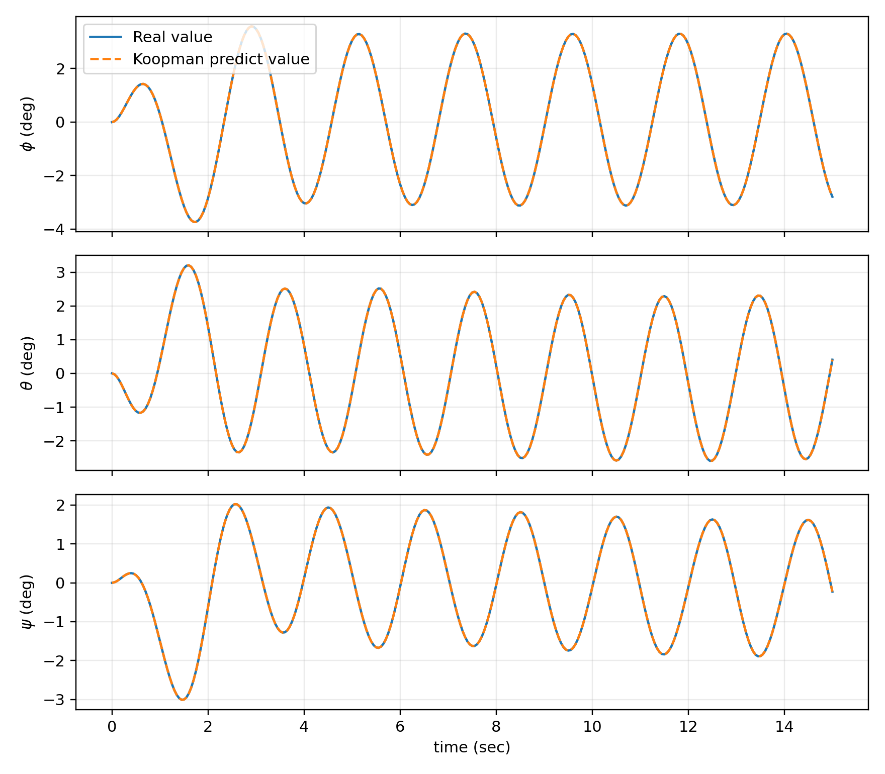
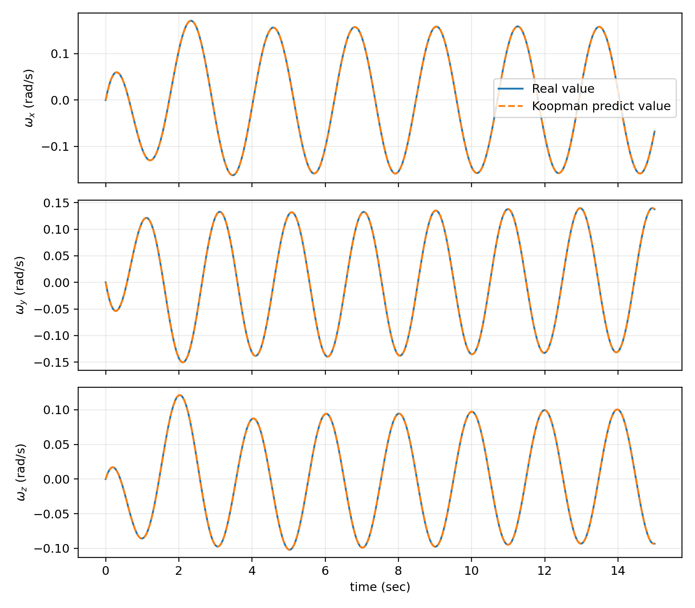
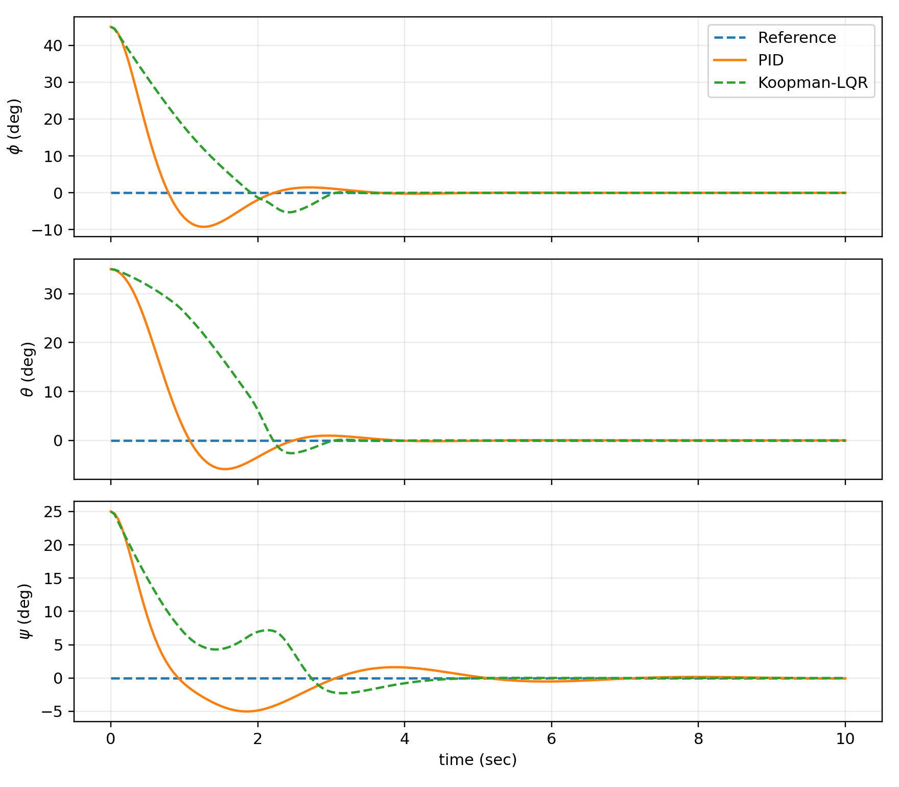

# Data-Driven Attitude Modeling and Control of a Quadrotor UAV Using the Koopman Operator

## Abstract

This project develops a data-driven method for modeling and controlling the attitude dynamics of a quadrotor UAV using the Koopman operator framework. The objective is to represent the nonlinear rotational dynamics in a lifted space where the evolution can be approximated by a linear input-driven model, and then use that identified model for linear quadratic regulator (LQR) control.

The implementation is intentionally focused on **attitude modeling and attitude control**. A MuJoCo software-in-the-loop (SITL) environment is used as the simulation platform. The rotational state consists of the attitude rotation matrix and body angular velocity, while the control input is a three-axis body torque.

The workflow consists of trajectory generation, Koopman lifting, Extended Dynamic Mode Decomposition (EDMD) / least-squares identification, validation, Koopman-LQR design, and comparison with a PID controller. Lifting orders from \(N=3\) to \(N=8\) are considered, and the \(N=5\) formulation gives a 45-dimensional lifted state used for the final controller.

The obtained SITL results show very close agreement between the simulated and Koopman-predicted attitude trajectories and body angular velocities. The closed-loop results also show lower settling time and lower overshoot for Koopman-LQR than the PID baseline for the reported roll and pitch channels, together with faster yaw convergence.

---

## 1. Introduction

Quadrotor UAVs require accurate attitude control to maintain a desired orientation and to respond correctly to control inputs. The three principal attitude variables are roll, pitch, and yaw, while the corresponding body angular velocities describe the rotational motion.

The attitude dynamics are nonlinear because of the rotational kinematics and the coupling between angular velocity and the rigid-body inertia. For data-driven control, it is useful to obtain a model that captures this nonlinear behavior while still allowing the use of well-established linear control methods.

The Koopman operator provides such a viewpoint. Instead of directly forcing the nonlinear physical state to follow a linear model, the state is mapped into a higher-dimensional space of observables. In this lifted space, the nonlinear dynamics can be approximated by a linear system with control input.

The complete project workflow is:

```text
Nonlinear attitude dynamics
          |
          v
      MuJoCo SITL
          |
          v
 State and torque data
          |
          v
    Koopman lifting
          |
          v
 EDMD / least-squares
          |
          v
     A and B model
          |
          v
    Koopman-LQR
          |
          v
 Closed-loop attitude control
          |
          v
       PID comparison
```

---

## 2. Project Objectives

The main objectives are:

1. Formulate the nonlinear attitude dynamics of a quadrotor UAV.
2. Represent the attitude state using a rotation matrix and body angular velocity.
3. Construct the structured Koopman lifting function.
4. Identify a linear input-driven model using EDMD / least-squares regression.
5. Investigate lifting orders \(N=3,4,5,6,7,8\).
6. Use the \(N=5\) lifted representation for the final controller.
7. Design a Koopman-LQR controller in the lifted state space.
8. Implement a PID controller as a baseline.
9. Evaluate both controllers in MuJoCo SITL.
10. Compare prediction accuracy, settling time, and overshoot.
11. Present the complete computational workflow in a reproducible Python implementation.

---

## 3. Scope

- Quadrotor attitude dynamics
- Roll, pitch, and yaw
- Body angular velocity
- Rotation-matrix representation
- Three-axis body torque
- Koopman lifting
- EDMD / least-squares identification
- Lifting-order study
- Validation trajectory prediction
- Koopman-LQR control
- PID comparison
- MuJoCo SITL simulation
- Settling-time analysis
- Overshoot analysis
- Attitude, angular-velocity, and control-input plots

---

# 4. Mathematical Model

## 4.1 Attitude dynamics

The rotational dynamics are described by the rotation matrix \(R\) and body angular velocity \(\omega\).

The continuous-time equations are

$$
\dot{R} = R\omega^\times
$$

and

$$
J\dot{\omega} = -\omega^{\times}J\omega + u + d(t)
$$

where:

- $R \in SO(3)$ is the rotation matrix.
- $\omega \in \mathbb{R}^3$ is the body-frame angular velocity.
- $J \in \mathbb{R}^{3\times3}$ is the inertia matrix.
- $u \in \mathbb{R}^3$ is the applied body torque.
- $d(t)$ represents an external disturbance.
The inertia matrix is represented as

$$
J=
\begin{bmatrix}
J_{xx}&0&0\\
0&J_{yy}&0\\
0&0&J_{zz}
\end{bmatrix}.
$$

For

$$
\omega=
\begin{bmatrix}
\omega_x\\
\omega_y\\
\omega_z
\end{bmatrix},
$$

the skew-symmetric matrix is

$$
\omega^\times=
\begin{bmatrix}
0&-\omega_z&\omega_y\\
\omega_z&0&-\omega_x\\
-\omega_y&\omega_x&0
\end{bmatrix}.
$$

The control input used by the implementation is

$$
u=
\begin{bmatrix}
\tau_x\\
\tau_y\\
\tau_z
\end{bmatrix},
$$

where \(\tau_x,\tau_y,\tau_z\) are the body torques about the three body axes.

---

## 4.2 Discrete-time representation

With sampling period \(T_s\), the nonlinear system can be represented in discrete form as

$$
x_{k+1}=f(x_k,u_k).
$$

The implementation uses

$$
T_s=0.05\ \mathrm{s}.
$$

Therefore, the data used for Koopman identification are sampled at

$$
f_s=\frac{1}{T_s}=20\ \mathrm{Hz}.
$$

---

# 5. Koopman Operator Formulation

For a nonlinear discrete-time system, the Koopman approach considers functions of the physical state rather than only the physical state itself.

Let

$$
z_k=\Phi(x_k)
$$

denote the lifted state.

The goal is to obtain a linear input-driven approximation

$$
z_{k+1}=Az_k+Bu_k.
$$

The physical system remains nonlinear. The linear representation exists in the selected lifted observable space.

This makes it possible to use standard linear control tools such as LQR after the data-driven model has been identified.

---

# 6. Koopman Lifting

The state used for the attitude model is represented as

$$
x=[R,\omega^\times].
$$

The lifting function is

$$
\Phi(x)=
\begin{bmatrix}
\mathrm{vec}(R^T)\\
\mathrm{vec}(R\omega^\times)\\
\mathrm{vec}(R(\omega^\times)^2)\\
\vdots\\
\mathrm{vec}(R(\omega^\times)^{N-1})
\end{bmatrix}.
$$

The notation \(\mathrm{vec}(\cdot)\) converts each \(3\times3\) matrix into a nine-element column vector.

For a matrix

$$
A=
\begin{bmatrix}
a_{11}&a_{12}&a_{13}\\
a_{21}&a_{22}&a_{23}\\
a_{31}&a_{32}&a_{33}
\end{bmatrix},
$$

the implementation uses

$$
\mathrm{vec}(A)=
\begin{bmatrix}
a_{11}\\
a_{12}\\
a_{13}\\
a_{21}\\
a_{22}\\
a_{23}\\
a_{31}\\
a_{32}\\
a_{33}
\end{bmatrix}.
$$

Each observable block therefore contains nine elements.

Hence,

$$
\dim(z)=9N.
$$

The investigated lifting orders are:

| \(N\) | Lifted dimension |
|---:|---:|
| 3 | 27 |
| 4 | 36 |
| 5 | 45 |
| 6 | 54 |
| 7 | 63 |
| 8 | 72 |

The selected implementation uses

$$
N=5,
$$

giving

$$
z\in\mathbb{R}^{45}.
$$

---

# 7. Data-Driven Model Identification

## 7.1 Snapshot data

For each sampled transition, the required data are

$$
(x_k,u_k,x_{k+1}).
$$

After applying the lifting function,

$$
z_k=\Phi(x_k),
$$

the data matrices are formed as

$$
P=
\begin{bmatrix}
z_1&z_2&\cdots&z_M\\
u_1&u_2&\cdots&u_M
\end{bmatrix}
$$

and

$$
Q=
\begin{bmatrix}
z_2&z_3&\cdots&z_{M+1}
\end{bmatrix}.
$$

The model satisfies approximately

$$
Q\approx KP,
$$

where

$$
K=
\begin{bmatrix}
A&B
\end{bmatrix}.
$$

For \(N=5\),

$$
A\in\mathbb{R}^{45\times45}
$$

and

$$
B\in\mathbb{R}^{45\times3}.
$$

---

## 7.2 Least-squares solution

The identification problem is

$$
K=
\arg\min_K
\left\|Q-KP\right\|_F^2.
$$

Using the Moore-Penrose pseudoinverse,

$$
K=QP^\dagger.
$$

The identified matrices are then extracted from \(K\):

$$
K=
\begin{bmatrix}
A&B
\end{bmatrix}.
$$

The resulting lifted model is

$$
\boxed{
z_{k+1}=Az_k+Bu_k
}.
$$

The implementation also evaluates the equivalent covariance formulation

$$
K=G_1G_2^\dagger,
$$

with

$$
G_1=
\frac{1}{M}
\sum_{k=1}^{M}
z_{k+1}
\begin{bmatrix}
z_k\\
u_k
\end{bmatrix}^{T}
$$

and

$$
G_2=
\frac{1}{M}
\sum_{k=1}^{M}
\begin{bmatrix}
z_k\\
u_k
\end{bmatrix}
\begin{bmatrix}
z_k\\
u_k
\end{bmatrix}^{T}.
$$

The two regression implementations are mathematically equivalent and provide an internal numerical consistency check.

---

# 8. Simulation and Data Generation

## 8.1 MuJoCo SITL environment

The attitude dynamics are simulated in MuJoCo.

The simulation provides:

- body orientation,
- body angular velocity,
- applied body torque,
- rigid-body rotational dynamics.

The MuJoCo orientation is converted to the rotation matrix \(R\) required by the Koopman lifting.

The control interface is

$$
u=
[\tau_x,\tau_y,\tau_z]^T.
$$

The Koopman controller therefore operates directly at the attitude-torque level.

---

## 8.2 Excitation trajectories

The data-generation trajectories use sinusoidal roll, pitch, and yaw references.

A general reference signal is represented as

$$
r_i(t) = A_i \sin(2\pi f_i t + \varphi_i)
$$

where:

- $A_i$ is the amplitude.
- $f_i$ is the frequency.
- $\varphi_i$ is the phase.

The excitation limits are:

$$
|A_i|\le10^\circ
$$

and

$$
f_i<0.6\ \mathrm{Hz}.
$$

Different trajectories use different parameter combinations so that the identification dataset contains a range of attitude and angular-velocity behavior.

---

## 8.3 Dataset configuration

| Parameter | Value |
|---|---:|
| Total trajectories | 40 |
| Training trajectories | 30 |
| Validation trajectories | 10 |
| Duration per trajectory | 15 s |
| Sampling period | 0.05 s |
| Maximum attitude amplitude | ±10° |
| Maximum excitation frequency | < 0.6 Hz |
| Lifting orders | \(3,4,5,6,7,8\) |

A fixed random seed is used in the implementation so that the generated trajectories can be reproduced.

The first 30 trajectories are used for model identification, while the remaining 10 are kept separate for validation.

---

# 9. State Recovery

For \(N=5\), the lifted state contains 45 elements.

The first 18 elements contain the state representation needed for physical reconstruction.

The extraction matrix is

$$
H =
\begin{bmatrix}
I_{18} & 0_{18\times27}
\end{bmatrix}
$$

Therefore,

$$
x = Hz
$$

The rotation matrix is recovered from the first nine elements.

The angular velocity representation is recovered from the next nine elements. Since

$$
R\omega^\times
$$

is available and $R$ is known,

<div align="center">

$$
\omega^\times = R^T (R\omega^\times)
$$

</div>
The angular velocity vector is then extracted from the skew-symmetric matrix.

This allows the lifted prediction to be converted back into physically meaningful attitude and angular-velocity variables for plotting and error evaluation.

---

# 10. Lifting-Order Study

Six lifting orders are investigated:

$$
N=3,4,5,6,7,8.
$$

For each order:

1. the training trajectories are lifted;
2. the corresponding \(A\) and \(B\) matrices are identified;
3. the model is evaluated using validation data;
4. the prediction error is recorded.

The normalized relative error is calculated with the \(N=8\) result used as the reference:

$$
e_N^{\mathrm{rel}} = \frac{e_N}{e_8}
$$

Therefore,

$$
e_8^{\mathrm{rel}} = 1
$$

The \(N=5\) model is used for the final Koopman-LQR implementation because it provides the selected 45-dimensional representation.

---

# 11. Koopman-LQR Controller

The identified model is

$$
z_{k+1}=Az_k+Bu_k.
$$

The control input is selected as

$$
u_k=-K_{\mathrm{LQR}}z_k.
$$

The infinite-horizon quadratic cost is

$$
J=
\sum_{k=0}^{\infty}
\left(
z_k^TQ_z z_k
+
u_k^TR_u u_k
\right),
$$

where

$$
Q_z\succeq0
$$

and

$$
R_u\succ0.
$$

The discrete algebraic Riccati equation is

$$P = A^T P A - A^T P B (R_u + B^T P B)^{-1} B^T P A + Q_z$$

The LQR gain is

$$K_{\mathrm{LQR}} = (R_u + B^T P B)^{-1} B^T P A$$

Therefore,

$$u_k = -K_{\mathrm{LQR}} z_k$$

For the $N = 5$ model,

$$K_{\mathrm{LQR}} \in \mathbb{R}^{3\times45}$$
The controller therefore uses the complete 45-dimensional lifted state rather than directly applying LQR to only the three Euler angles and three angular velocities.

---

# 12. PID Controller

A three-axis PID controller is used as the baseline.

The attitude error is

$$e(t) = \begin{bmatrix} \phi_d - \phi \\ \theta_d - \theta \\ \psi_d - \psi \end{bmatrix}$$

The PID torque command is

$$u(t) = K_P e(t) + K_I \int e(t)\,dt + K_D \dot{e}(t)$$
The same MuJoCo plant and torque interface are used for both controllers.

This ensures that the comparison is performed under the same simulation conditions.

---

# 13. Closed-Loop Experiment

The control experiment uses the desired attitude

$$
\phi_d=\theta_d=\psi_d=0.
$$

The same initial condition is applied to both controllers.

The closed-loop sequence is:

```text
MuJoCo state
     |
     v
Rotation matrix + angular velocity
     |
     v
Koopman lifting
     |
     v
45-dimensional state z
     |
     v
u = -K_LQR z
     |
     v
Three-axis body torque
     |
     v
MuJoCo
```

The PID controller follows the same loop structure except that its torque is calculated from the attitude error and its integral/derivative terms.

---

# 14. Results

## 14.1 Attitude Prediction

The following result compares the simulated attitude with the Koopman prediction.



Roll ($\phi$), pitch ($\theta$), and yaw ($\psi$) prediction using the identified Koopman model.

The predicted trajectories closely follow the simulated trajectories over the complete 15-second interval. The solid and dashed curves are almost completely overlapped for all three attitude channels.

This indicates that the identified lifted model captures the dominant attitude behavior of the simulated system over the validation trajectory.

---

## 14.2 Angular-Velocity Prediction

The body angular velocity prediction is shown below.



Body angular velocity prediction for $\omega_x$, $\omega_y$, and $\omega_z$.

The Koopman prediction follows the simulated angular velocities closely. The agreement is maintained over the oscillatory response and across all three angular-velocity channels.

This is important because the angular velocity is directly involved in the rotational dynamics and is also part of the state information used by the lifted representation.

---

## 14.3 PID versus Koopman-LQR

The closed-loop attitude response is shown below.



Comparison of PID and Koopman-LQR for roll, pitch, and yaw stabilization.

The reference attitude is zero for all three channels.

The Koopman-LQR controller reaches the desired attitude with less overshoot in roll and pitch and with faster convergence in yaw for the current SITL configuration.

---

# 15. Quantitative Control Results

The current validated control results are summarized below.

| Channel | Controller | Settling Time (s) | Overshoot |
|---|---|---:|---:|
| Roll ($\phi$) | PID | 3.15 | 20.53% |
| Roll ($\phi$) | Koopman-LQR | **2.95** | **11.74%** |
| Pitch ($\theta$) | PID | 3.35 | 16.80% |
| Pitch ($\theta$) | Koopman-LQR | **2.90** | **7.51%** |
| Yaw ($\psi$) | PID | 6.15 | — |
| Yaw ($\phi$) | Koopman-LQR | **4.20** | — |

The Koopman-LQR controller improves the settling time in all three channels.

### Roll

The settling time decreases from

$$
3.15\ \mathrm{s}
$$

to

$$
2.95\ \mathrm{s}.
$$

The reduction is

$$
\frac{3.15-2.95}{3.15}\times100
\approx6.35\%.
$$

The overshoot decreases from

$$
20.53\%
$$

to

$$
11.74\%.
$$

This corresponds to an approximate overshoot reduction of

$$
42.82\%.
$$

### Pitch

The settling time decreases from

$$
3.35\ \mathrm{s}
$$

to

$$
2.90\ \mathrm{s}.
$$

The reduction is

$$
\frac{3.35-2.90}{3.35}\times100
\approx13.43\%.
$$

The overshoot decreases from

$$
16.80\%
$$

to

$$
7.51\%.
$$

This corresponds to an approximate overshoot reduction of

$$
55.30\%.
$$

### Yaw

The settling time decreases from

$$
6.15\ \mathrm{s}
$$

to

$$
4.20\ \mathrm{s}.
$$

The reduction is

$$
\frac{6.15-4.20}{6.15}\times100
\approx31.71\%.
$$

The current result table does not report a yaw overshoot value.

---

# 16. Result Discussion

## 16.1 Koopman prediction

The attitude prediction result shows that the learned lifted model follows the simulated nonlinear trajectory very closely.

The same behavior is observed for body angular velocity. The predicted oscillations have almost the same frequency, phase, and amplitude as the simulated response.

This indicates that the selected observable structure contains useful information about the rotational dynamics in the tested operating region.

---

## 16.2 Attitude stabilization

The closed-loop results show that Koopman-LQR provides a faster transient response than PID for the current simulation configuration.

The improvement is particularly clear for:

- roll overshoot,
- pitch overshoot,
- yaw settling time.

The result is consistent with the role of the Koopman model in this project: the controller operates on a lifted representation that captures nonlinear attitude behavior while retaining a linear state-space structure for LQR design.

---

## 16.3 Control-performance summary

| Metric | Roll | Pitch | Yaw |
|---|---:|---:|---:|
| Settling-time reduction | 6.35% | 13.43% | 31.71% |
| Overshoot reduction | 42.82% | 55.30% | -- |

The largest settling-time improvement is obtained for yaw, while the largest reported overshoot reduction is obtained for pitch.

---

# 17. Methodology Summary

The complete methodology can be summarized in five stages.

### Stage 1 — Simulation

MuJoCo generates attitude, angular velocity, and applied body-torque data.

### Stage 2 — Lifting

The physical state is transformed into the structured Koopman observable vector

$$
z=\Phi(x).
$$

### Stage 3 — Identification

EDMD / least-squares regression identifies

$$
z_{k+1}=Az_k+Bu_k.
$$

### Stage 4 — Control

The \(N=5\) model is used to design

$$
u=-K_{\mathrm{LQR}}z.
$$

### Stage 5 — Evaluation

The Koopman-LQR response is compared with PID using:

- attitude response,
- settling time,
- overshoot,
- angular velocity behavior,
- control performance.

---

# 18. Software Architecture

The implementation is intentionally organized into a small number of Python files.

```text
Drones_2_Koopman_SITL/
│
├── README.md
│
├── config.py
│   └── Experiment and simulation parameters
│
├── mujoco_attitude.py
│   └── MuJoCo attitude simulation interface
│
├── koopman.py
│   └── Koopman lifting, EDMD, state recovery, and LQR
│
├── experiments.py
│   └── Dataset generation and control experiments
│
├── plot_results.py
│   └── Result tables and figures
│
├── requirements.txt
│
├── model/
│   └── quadrotor_attitude.xml
│
├── assets/
│   ├── image1.png
│   ├── image2.png
│   └── image3.png
│
├── data/
│   ├── training.npz
│   └── validation.npz
│
├── models/
│   ├── koopman_N3.npz
│   ├── koopman_N4.npz
│   ├── koopman_N5.npz
│   ├── koopman_N6.npz
│   ├── koopman_N7.npz
│   └── koopman_N8.npz
│
└── results/
    ├── table_I.csv
    ├── table_II.csv
    ├── figure_2_attitude_prediction.png
    ├── figure_3_velocity_prediction.png
    ├── figure_4_attitude_control.png
    ├── figure_5_velocity_control.png
    └── figure_6_control_torque.png
```

---

# 19. Reproducibility

## 19.1 Environment setup

Create a Python virtual environment:

```bash
python -m venv .venv
```

Activate the environment.

For Windows PowerShell:

```powershell
.\.venv\Scripts\Activate.ps1
```

For Linux/macOS:

```bash
source .venv/bin/activate
```

Install the required packages:

```bash
pip install -r requirements.txt
```

---

## 19.2 Verify the installation

Run:

```bash
python -c "import mujoco, numpy, scipy, matplotlib; print('All dependencies OK')"
```

Compile the project:

```bash
python -m py_compile config.py mujoco_attitude.py koopman.py experiments.py plot_results.py
```

Run the Koopman dimension tests:

```bash
python koopman.py
```

Run the MuJoCo attitude test:

```bash
python mujoco_attitude.py
```

---

## 19.3 Run the complete experiment

Generate the dataset, identify the models, run the control experiments, and save the numerical results:

```bash
python experiments.py
```

Generate the final plots:

```bash
python plot_results.py
```

The results are stored in the `results/` directory.

---

# 20. Parameter Transparency

For reproducibility, it is important to distinguish between parameters defined by the selected methodology and parameters required to construct the SITL environment.

### Methodology parameters

| Parameter | Value |
|---|---:|
| Sampling period | 0.05 s |
| Trajectory duration | 15 s |
| Number of trajectories | 40 |
| Training trajectories | 30 |
| Validation trajectories | 10 |
| Maximum attitude amplitude | ±10° |
| Maximum excitation frequency | < 0.6 Hz |
| Lifting orders | 3–8 |
| Selected lifting order | 5 |
| Lifted dimension at \(N=5\) | 45 |
| Controller | Koopman-LQR |
| Baseline controller | PID |
| Desired attitude $(\phi,\theta,\psi)$ | $(0^\circ,\ 0^\circ,\ 0^\circ)$ |

### SITL-specific parameters

The following values are implementation parameters required by the simulation environment:

- MuJoCo body mass
- MuJoCo inertia values
- internal MuJoCo timestep
- trajectory-generation controller parameters
- PID gains
- LQR weighting matrices
- torque limits
- random seed
- numerical settling-time tolerance

These parameters are kept in the project configuration so that the simulation can be reproduced consistently.

---

# 21. Current Result Status

The current results demonstrate three important outcomes.

### 1. Accurate prediction

The Koopman model follows the simulated attitude trajectory closely over the validation interval.

### 2. Accurate angular-velocity prediction

The learned model also captures the body angular-velocity behavior with close agreement between simulated and predicted trajectories.

### 3. Improved closed-loop response

The current Koopman-LQR implementation provides:

- lower roll settling time,
- lower pitch settling time,
- lower yaw settling time,
- lower roll overshoot,
- lower pitch overshoot.

The current results are therefore sufficient to demonstrate the intended modeling and control workflow in the implemented SITL environment.

---


# 23. Conclusion

This project presents a complete data-driven workflow for quadrotor attitude modeling and control using the Koopman operator framework.

The nonlinear rotational dynamics are transformed into a structured lifted state using the rotation matrix and body angular velocity. EDMD / least-squares identification is then used to obtain a linear input-driven model in the lifted space.

The investigated lifting orders range from \(N=3\) to \(N=8\), with \(N=5\) providing the selected 45-dimensional representation for the final control implementation.

The identified model is used to design a Koopman-LQR controller, and its performance is compared with a PID baseline in MuJoCo SITL.

The obtained results show:

- close agreement between simulated and Koopman-predicted attitude;
- close agreement between simulated and Koopman-predicted angular velocity;
- 6.35% lower roll settling time with Koopman-LQR;
- 13.43% lower pitch settling time;
- 31.71% lower yaw settling time;
- 42.82% lower roll overshoot;
- 55.30% lower pitch overshoot.

Overall, the results demonstrate that a Koopman-based lifted representation can provide a useful linear model for attitude control while retaining the nonlinear behavior observed in the simulated rotational dynamics.

---

# 24. References

1. **W. Zhu, F. Wu, J. Zhou, H. Du, J. Xiao, and L. Li**, “Data-Driven Attitude Modeling and Control of Quadrotor UAVs using Koopman Operator,” *2025 IEEE International Conference on Unmanned Systems (ICUS)*, pp. 1163–1168, 2025.  
   [DOI: 10.1109/ICUS66297.2025.11294303](https://doi.org/10.1109/ICUS66297.2025.11294303)

2. **B. O. Koopman**, “Hamiltonian Systems and Transformation in Hilbert Space,” *Proceedings of the National Academy of Sciences*, vol. 17, no. 5, pp. 315–318, 1931.  
   [PNAS](https://www.pnas.org/doi/10.1073/pnas.17.5.315)

3. **J. L. Proctor, S. L. Brunton, and J. N. Kutz**, “Dynamic Mode Decomposition with Control,” *SIAM Journal on Applied Dynamical Systems*, vol. 15, no. 1, pp. 142–161, 2016.  
   [DOI: 10.1137/15M1013857](https://doi.org/10.1137/15M1013857)

4. **M. O. Williams, C. W. Rowley, and I. G. Kevrekidis**, “A Kernel-Based Method for Data-Driven Koopman Spectral Analysis,” *Journal of Computational Dynamics*, vol. 2, no. 2, pp. 247–265, 2015.  
   [DOI: 10.3934/jcd.2015005](https://doi.org/10.3934/jcd.2015005)

5. **MuJoCo Documentation**, Official Python API and simulation documentation.  
   [MuJoCo Documentation](https://mujoco.readthedocs.io/en/latest/python.html)

